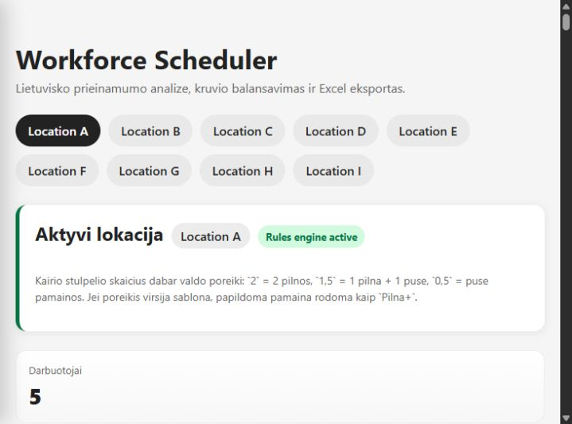
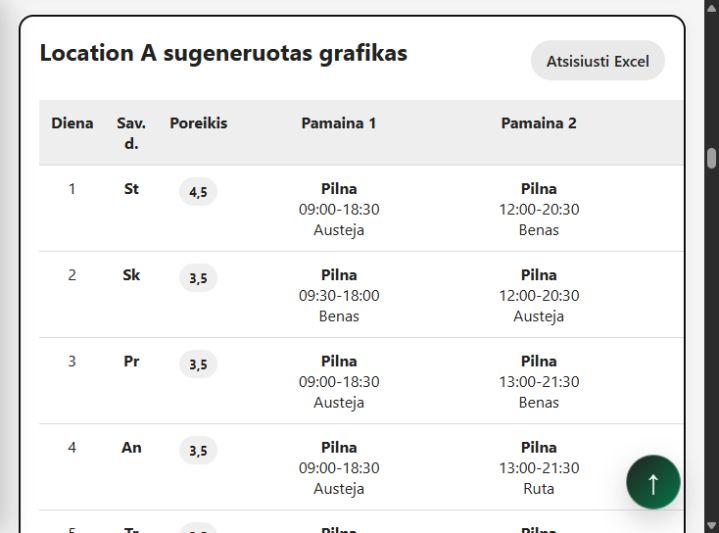
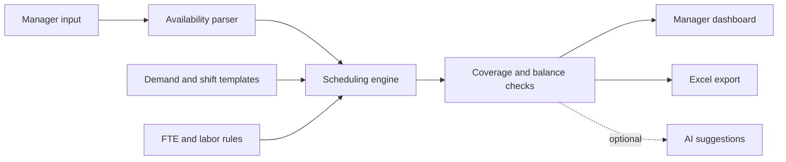

# Workforce Scheduler

A Flask application that turns Lithuanian natural-language availability into a
monthly employee schedule. It combines staffing demand, location-specific shift
templates, employee FTE targets, coverage rules, workload balancing, and Excel
export in one manager-facing workflow.



## Why this exists

Small hospitality teams often collect availability as free-form messages and
assemble schedules manually. That makes missing days, uncovered shifts, and
uneven hours hard to spot. This project keeps the familiar free-text input while
adding repeatable scheduling rules and visible warnings.

## Features

- Lithuanian availability parsing: `galiu`, `negaliu`, `nuo 16:40`, `iki 17`,
  `10-18`, `iki14/nuo19`, and morning preferences.
- One availability line per calendar day, including preserved blank days.
- Configurable month, full-time monthly hours, staffing demand, and employee FTE.
- Full, partial, and template-override shifts when demand exceeds the base plan.
- Coverage, minimum-rest, consecutive-day, and workload-balance checks.
- Editable schedule drafts that preserve manual assignments and fill only open shifts.
- XLSX/CSV partial-schedule import that keeps exact shift times and carries recent
  same-slot timing into later blank days.
- Per-shift time editing before saving or completing a draft.
- Employee editing and incomplete-input warnings.
- A newcomer flag that blocks automatic and new manual opening assignments while warning on preserved imported ones.
- Compact Excel schedule export with warnings and employee summaries.
- Optional OpenAI-assisted schedule suggestions when `OPENAI_API_KEY` is set.
- Local employee data and generated exports excluded from Git.



## Architecture



The public repository uses generic locations and synthetic examples. Real
employee inputs remain only in the ignored local `scheduler_data.json` file.

## Privacy boundary

This repository is the sanitized portfolio version. It contains only generic
`Location A` through `Location I` configuration and `Worker A` style test data.
Real employee names, availability, saved schedules, spreadsheet history,
exports, and environment secrets belong only in the separate private workspace.

Run the privacy gate before publishing:

```powershell
python scripts/privacy_check.py
```

The same check runs in GitHub Actions and rejects tracked operational data,
spreadsheet files, private archive folders, local user paths, and secrets.

## Run locally

```powershell
python -m venv .venv
.\.venv\Scripts\Activate.ps1
python -m pip install -r requirements.txt
python app.py
```

Open `http://127.0.0.1:5000`.

Optional configuration:

```powershell
$env:OPENAI_API_KEY = "your-key"
$env:OPENAI_MODEL = "gpt-5-mini"
$env:FLASK_DEBUG = "1"
```

The rules-based scheduler works without an OpenAI key.

## Tests

```powershell
python -m unittest discover -s tests -v
```

The regression suite covers availability parsing, blank calendar positions,
template overrides, configurable FTE targets, partial availability, imported
custom shift times, worker editing, and Excel export formatting.

## Monthly workflow

1. Select the target month and full-time monthly hour total.
2. Set daily staffing demand.
3. Add each employee and paste one availability line per calendar day.
4. Resolve incomplete-input warnings or intentionally continue with partial data.
5. Generate a schedule, create an empty draft, or upload a partially completed XLSX/CSV file.
6. Review assignments and edit any shift time directly in the schedule table.
7. Save the draft or complete only its open shifts, then review coverage and workload warnings.
8. Export the manager-ready Excel workbook.

## Project status

This is a portfolio-ready MVP built from a real operations problem. It is not a
payroll or legal-compliance system; managers remain responsible for validating
the final schedule against applicable labor rules and company policy.

## License

MIT. See [LICENSE](LICENSE).
